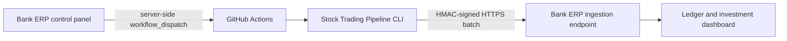
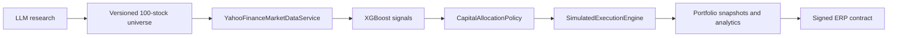

# Stock Trading Pipeline

A personal quantitative-investment research and **simulated-trading** platform. It researches a
versioned universe of exactly 100 stocks monthly, retrieves completed daily candles through one
Yahoo Finance boundary, runs leakage-aware XGBoost inference, allocates capital deterministically,
simulates end-of-day executions, accounts for P&L with `Decimal`, and sends signed results to Bank
ERP. It contains no real-broker integration and cannot place real orders.

## Architecture





The safety boundary is simple: **AI researches; models rank; deterministic policies allocate;
simulation executes; the ledger records; Bank ERP observes.** LLM output is validated as untrusted
input. It cannot size positions, apply stops, alter balances, or bypass accounting controls.

## Setup and commands

```powershell
python -m venv .venv
.venv\Scripts\Activate.ps1
python -m pip install -e ".[dev,market-data,research]"
trading-system config-validate
trading-system research-universe
trading-system update-market-data
trading-system run-eod --model data/processed/xgboost_model_market_data_20260705_212648.joblib
python -m pytest -q
```

`research-universe` reuses the current month by default. Use `--force` only for an intentional paid
refresh. The service rejects 99/101 members, duplicates, malformed ranks, and Yahoo-unavailable
symbols; it retries the LLM with precise repair feedback rather than shrinking the universe.

`run-eod` asks Yahoo for the latest completed SPY session. If that session is already complete, or
no new completed session exists, it exits without creating trades, decisions, snapshots, or ERP
events. Idempotency keys include strategy run, market session, ticker, and decision type.

## GitHub Actions

- `monthly-research.yml`: scheduled monthly and manually dispatchable; creates the universe and
  primes market history.
- `daily-market-cycle.yml`: runs at 23:15 UTC Monday-Friday (after US close in EST and EDT), restores
  durable state, invokes `run-eod`, and uploads state/reports. The CLI performs the market-day check.
- `manual-strategy-run.yml`: explicit manual EOD dispatch.

Actions only orchestrate normal CLI commands. Failures remain visible in logs. Generated state and
reports are retained as artifacts; production deployments should replace artifact persistence with
durable object/database storage if retention beyond 95 days is required.

## Configuration

Configuration lives in `config/base.yaml` and can be overridden with environment variables:

| Variable | Purpose |
|---|---|
| `OPENAI_API_KEY` | Monthly research provider credential |
| `LLM_PROVIDER`, `LLM_MODEL`, `INVESTMENT_THEME` | Configurable research boundary |
| `INITIAL_CAPITAL`, `MODEL_THRESHOLD` | Portfolio and signal policy |
| `BENCHMARKS` | Comma-separated benchmarks; defaults to SPY, QQQ |
| `ERP_ENDPOINT`, `ERP_HMAC_SECRET` | Signed server-to-server ERP ingestion |
| `ERP_ACCOUNT_EXTERNAL_ID` | Simulated portfolio identity |
| `TRADING_DATABASE_PATH`, `ARTIFACT_ROOT`, `MARKET_DATA_CACHE` | Durable local paths |

Never commit keys or HMAC secrets. The ERP endpoint must use HTTPS except on localhost.

## Data and accounting

`YahooFinanceMarketDataService` batches requests, normalizes yfinance MultiIndex responses, retries
with exponential backoff, rate-limits batches, records missing symbols, detects stale prices, and
caches normalized adjusted OHLCV. Stop loss and allocation policy are deterministic. Every simulated
trade has a decision, universe/run lineage, Yahoo market timestamp, before/after portfolio value,
fees, and realized P&L. One authoritative snapshot is allowed per market session.

See `docs/architecture_inventory.md` for the pre-change inventory and `docs/operations_runbook.md`
for operating details.

## Agentic Trading API

A read-only FastAPI service exposes the simulated-trading ledger to agents and dashboards
(for example the Bank ERP "Agentic Trading" page):

```bash
trading-system api --host 127.0.0.1 --port 8000
```

All endpoints are `GET` and return JSON:

| Endpoint | Returns |
|---|---|
| `/health` | `{"status": "ok", "version": ...}` liveness probe |
| `/api/portfolio` | cash, starting capital, realized P&L, portfolio peak, position count |
| `/api/positions` | open positions: ticker, quantity, average cost |
| `/api/trades?limit=50` | simulated trades with the linked AI decision's confidence, rationale, and metadata |
| `/api/decisions?limit=50` | trade decisions: side, reason, confidence, rationale, metadata |
| `/api/universe?limit=100` | latest research universe: thesis, catalysts, risks, confidence |

Safety: the server opens the SQLite database with `mode=ro`, so it can never write to the
ledger; the `api` command is wired before any writable `Storage` construction. There are no
trading, order, or mutation endpoints. The database path comes from `TRADING_DATABASE_PATH`
(default `data/trading_system.db`). Money fields serialize as strings and timestamps as ISO-8601.
