# Safe Trading Research and Paper-Trading System

This repository is an auditable modular monolith for stock-universe research, leakage-aware XGBoost evaluation, structured news analysis, deterministic decisions and risk checks, fake/paper execution, reconciliation, portfolio accounting, and versioned export to Bank ERP.

It is not an unrestricted live-trading application. Paper mode is the default. Agents can propose universes and interpret retrieved news, but they cannot size orders, approve risk, call brokers, alter the ledger, or bypass execution gates.

## Architecture

```mermaid
flowchart LR
  UR[Universe Research Agent] --> UP[Universe Policy]
  UP --> MD[Market Data]
  MD --> FT[Features + Leakage Audit]
  FT --> XG[XGBoost Evaluation]
  XG --> MR[Model Registry + Approval]
  MR --> MS[Model Signal]
  NC[News Collector] --> NA[News Analysis]
  MS --> DA[Decision Agent]
  NA --> DA
  DA --> RE[Deterministic Risk Engine]
  RE --> AP[Exact Approval]
  AP --> EA[Execution Service]
  EA --> BA[Fake/Paper Broker Adapter]
  BA --> RC[Reconciliation]
  RC --> PL[Portfolio Ledger]
  PL --> ERP[Versioned Bank ERP Export]
```



Every stage has explicit typed inputs and outputs. Material records carry UTC timestamps, run and correlation IDs, status, provenance, and schema versions. Money and quantities use `Decimal`; ERP values cross the boundary as canonical decimal strings.

## Safety model

Only `ExecutionService` can call a broker adapter. In paper mode it rejects live-capable adapters. Live mode remains unusable with the supplied `DisabledLiveBrokerAdapter`, and submission fails unless all independent gates pass: live mode, explicit enable flags, adapter live capability and enablement, credentials, deterministic risk approval, exact unexpired human approval, unique idempotency, inactive kill switch, fresh market/account state, live-test evidence, and warning acknowledgement. No LLM participates in those checks.

## Quick start

```powershell
python -m venv .venv
.venv\Scripts\Activate.ps1
python -m pip install -e ".[dev,market-data,research]"
trading-system config validate
pytest -q
trading-system run daily --fixture --workspace artifacts/runs/fixture-daily
trading-system health
```

The fixture run trains and explicitly approves a small XGBoost model, creates evidence-linked news analysis, makes a recommendation, runs deterministic risk, records paper approval, fills through `FakeBrokerAdapter`, reconciles, updates an immutable ledger, and writes an ERP batch. It never contacts a broker, paid provider, or external LLM.

## Preserved research workflow

The legacy commands still work:

```powershell
python src/data/download_market_data.py --universe src/agents/ticker_universe.json --output data/raw/market_data.parquet
python src/agents/train_xgboost.py --device cpu
```

The target remains “maximum closing-price return of at least 10% during the next 50 sessions.” Chronological validation retains a 50-session embargo. Existing momentum, moving-average, RSI, MACD, volatility, liquidity features, universe structure, command-line aliases, and JSON/CSV/joblib artifact outputs are preserved. New production code lives in the installable `trading_system` package.

The observed legacy validation run on 2026-08-01 produced ROC AUC `0.577535`, accuracy `0.867040`, and majority-class accuracy `0.887557`; it therefore did not beat the majority baseline on accuracy and must not be interpreted as evidence of profitability or automatic promotion.

## Configuration

Precedence is defaults, `config/base.yaml`, environment config, environment variables, then narrowly scoped CLI overrides. See `.env.example`; never commit real values. Contradictory configuration is rejected. `config/live.example.yaml` is deliberately non-enabling.

## Operations

- `trading-system config validate` validates configuration and reports live readiness false.
- `trading-system run daily --fixture --workspace <path>` runs the deterministic demo.
- `trading-system health` reports process, dependency, model, broker, ERP, kill-switch, and live-readiness categories.
- `trading-system kill-switch enable --reason "..."` stops execution.
- `trading-system kill-switch disable` explicitly clears it.
- `php scripts/import_investment_batch.php <batch.json>` imports a batch into Bank ERP; re-import is idempotent.

## Documentation

See `docs/architecture.md`, `agent_contracts.md`, `data_contracts.md`, `modeling.md`, `risk_management.md`, `paper_trading.md`, `bank_erp_integration.md`, `observability.md`, `operations_runbook.md`, `threat_model.md`, `migration_guide.md`, `testing_strategy.md`, and `implementation_report.md`.

## Current limitations

The production paper-broker provider, authenticated HTTP ERP transport, RSS/credentialed news providers, LLM adapters, point-in-time constituent data, exchange calendar, corporate-action ledger automation, walk-forward/backtest report UI, and PostgreSQL migrations remain external follow-up work. The supplied deterministic path is complete and tested; those external integrations are not claimed as implemented.

